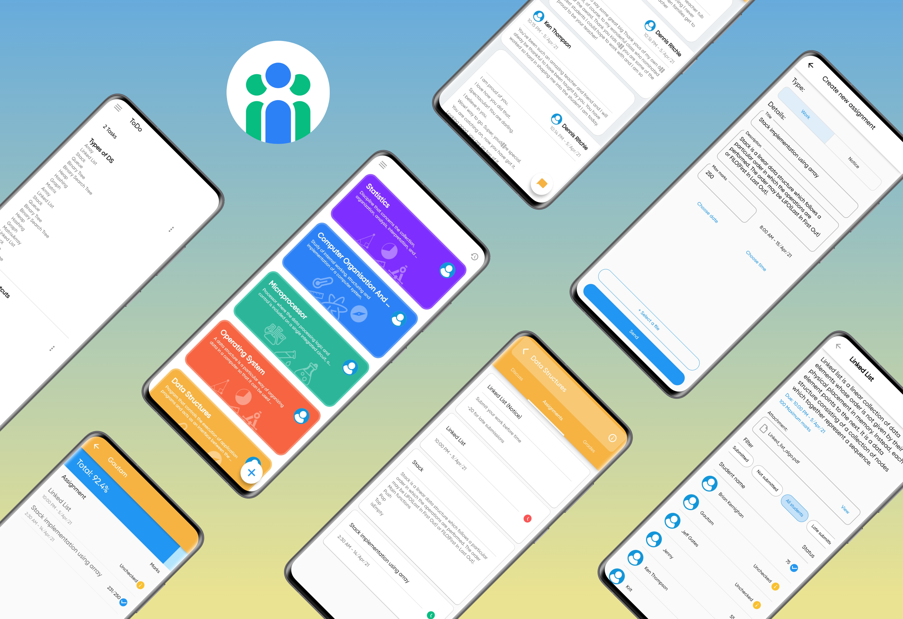
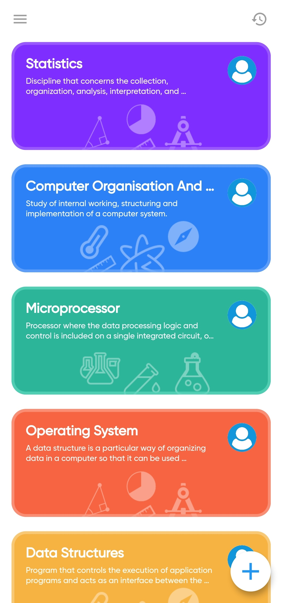
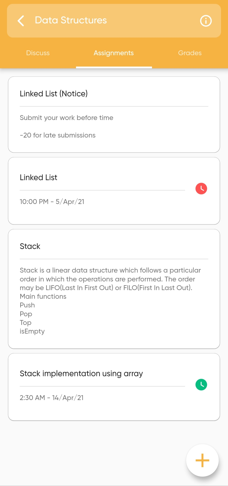
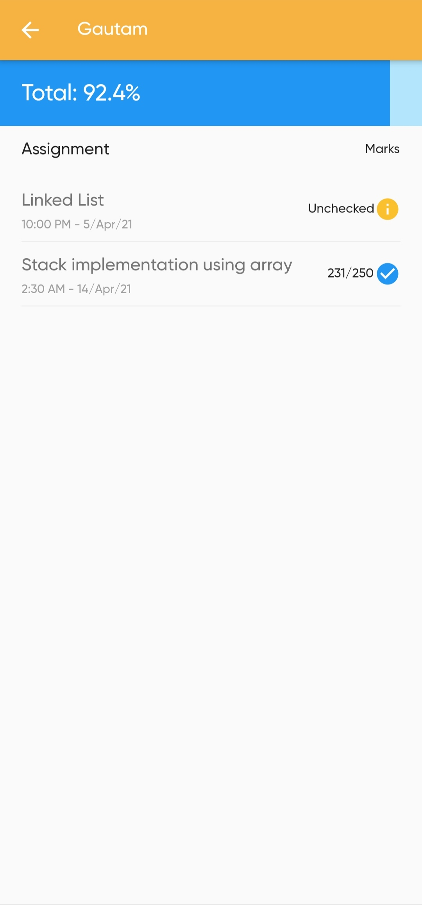
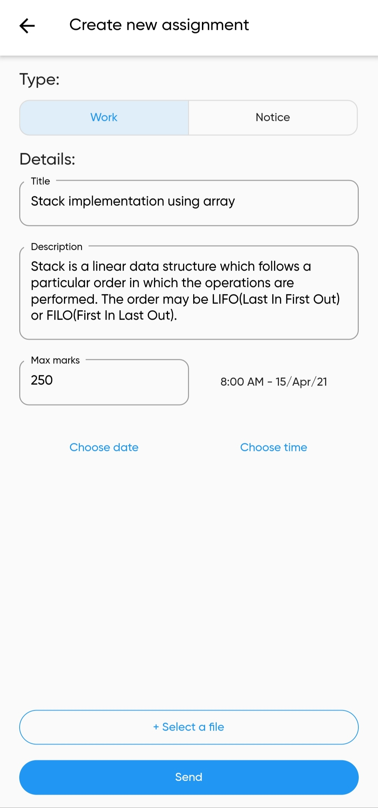
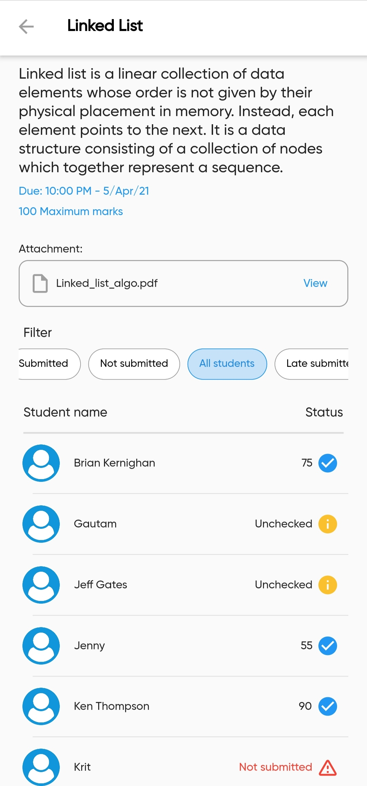
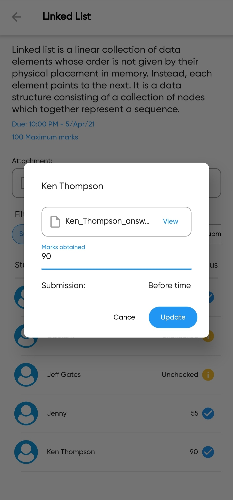
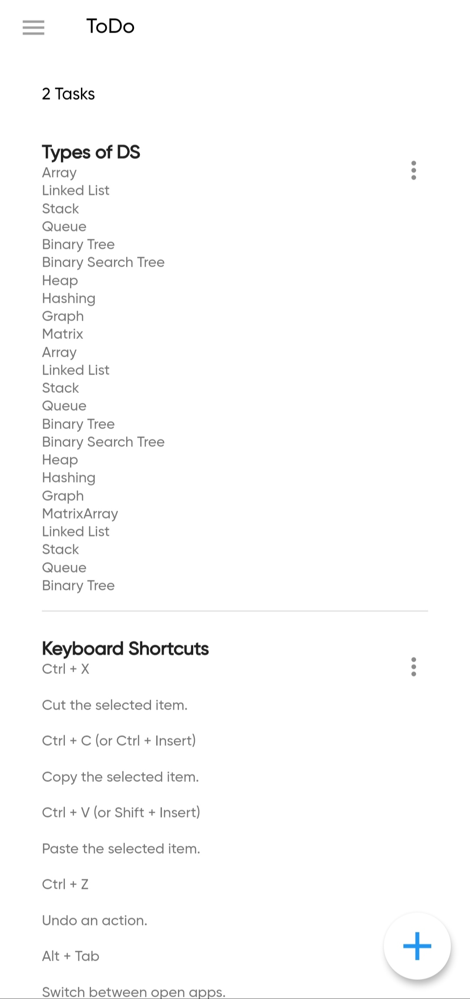
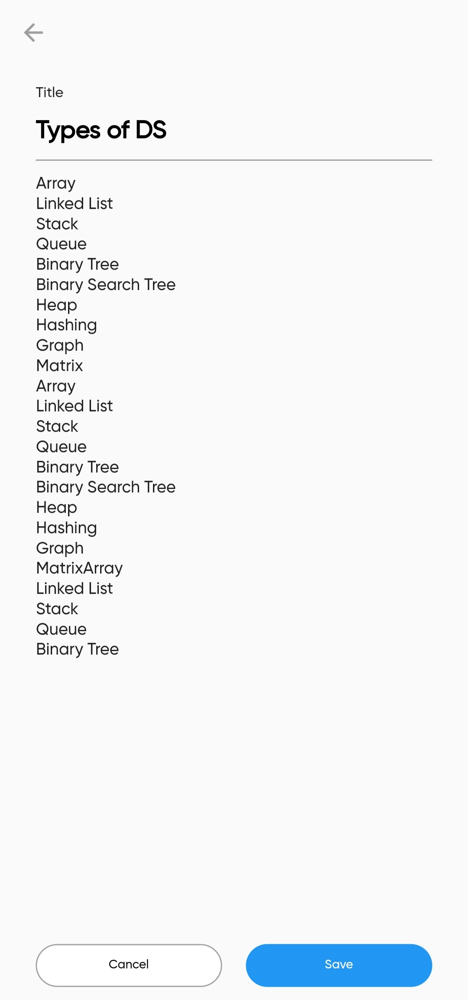
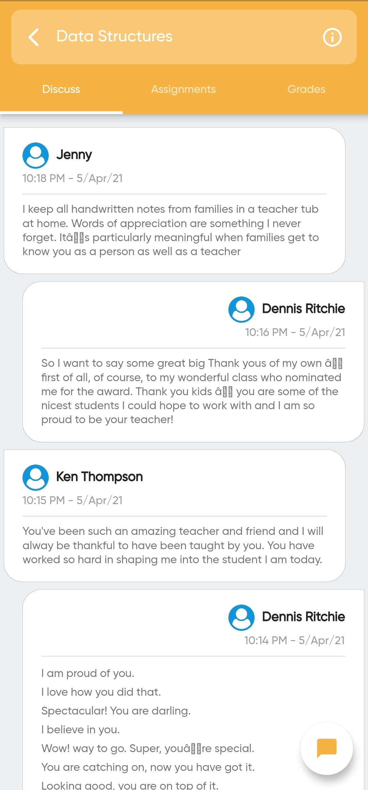

# SmartLearn 
>SmartLearn aims to create a interface for teachers to simply create, distribute, and grade assignments. And where students can ask doubt, submit work and view their progress. 

## Screenshots

| **Classrooms** | **Assignments** | **Grades** |
  | :---: | :---: | :---: |
  | <kbd></kbd> | <kbd></kbd> | <kbd></kbd> |
  | **New assignment** | **Filter submissions** | **Update marks** |
  | <kbd></kbd> | <kbd></kbd> | <kbd></kbd> |
  | **Todo list** | **Edit todo** | **Discussion** |
  | <kbd></kbd> | <kbd></kbd> | <kbd></kbd> |

## Built with
* Frontend - [Flutter](https://github.com/flutter/flutter)
* Backend - [DRF](https://www.django-rest-framework.org/)

## Features
* Authentication with Email verification
* Discussion between students and teacher
* Teacher can categorize student's answer sheet 
* Teacher can create notice
* Single view to see all assignment's status and grades
* To do list
* And many more

## Acknowledgements
* Designed by
  - [Kirtanya Kardum](https://github.com/kirtanya)
* Developed by 
  - [Nidhi Sharma](https://github.com/NidhiSharma1408)
  - [Utkarsh Patel](https://github.com/arshutk)
  - [Somesh Mishra](https://github.com/somesh37)

> Here's the [link](https://github.com/arshutk/SmartLearn) for backend repo  

<!-- https://cutt.ly/SmartLearn -->

<!-- Login credentials for test accounts : Teacher (one@teacher.com : password) : Student (one@student.com : password) -->
